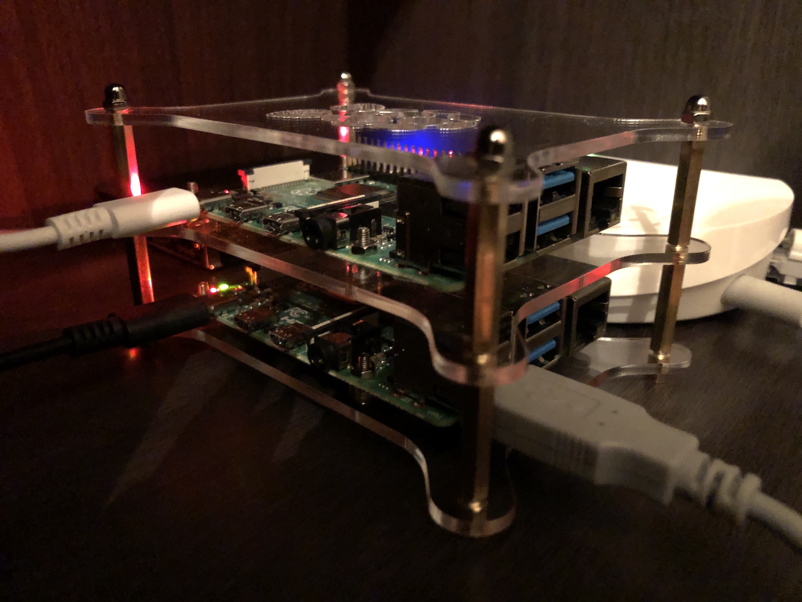

# Raspberry Pi K3s Homelab

This repository contains my random notes on building and deploying a [K3s]
Kubernetes cluster using Raspberry Pis. I have a short memory so this makes it
easier to remember why/how I did things...and may help others who travel down
this path.

## Raspberry Pi

[Raspberry Pi] are small single-board computers ideal for home projects,
clustering, and IoT edge devices. They are built using ARM processors and
provide support for numerous input and output devices.

My cluster is built with [Raspberry Pi 4 Model B]:

- Quad core ARM v8 (64bit) 1.5GHz CPU
- 8Gb RAM
- 2.45GHz and 5GHz wifi
- Bluetooth
- Gigabit ethernet
- 2 USB 2 and 2 USB 3 ports
- 2x micro-HDMI ports, supports 2 4K monitors
- Micro-SD card for operating system and internal data storage
- ...

I am running Ubuntu 20.04.1 LTS 64bit as the operating system.

## Ubuntu OS Installation

The [Install Ubuntu on a Raspberry Pi] documentation and installer is extremely
easy to follow to install the Ubuntu OS on your SD card. I chose the recommended
Ubuntu Server 20.04.1 LTS 64bit option as I was more interested in running this
headless, for now, than installing a full desktop.

[k3s]: https://k3s.io/
[raspberry pi]: https://www.raspberrypi.org/
[raspberry pi 4 model b]:
  https://www.raspberrypi.org/products/raspberry-pi-4-model-b/specifications/
[install ubuntu on a raspberry pi]: https://ubuntu.com/download/raspberry-pi
